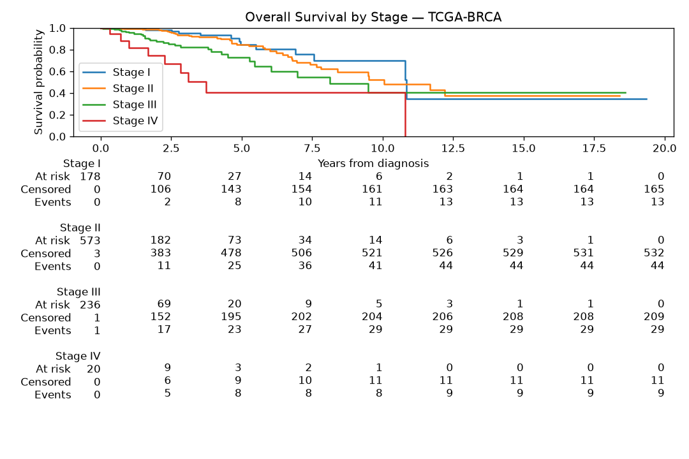

# Breast Cancer Survival — TCGA-BRCA

**Who lives longer after a breast cancer diagnosis, and why?**

An end-to-end clinical data pipeline on **real, de-identified patient data**: reconcile the follow-up records, run a survival analysis, standardise the data into the drug industry's CDISC formats (SDTM and ADaM), and present the findings in an interactive dashboard.

**Short answer:** How far the cancer has spread (stage) and the patient's age are the strongest drivers of survival. Molecular subtype matters less once stage and age are accounted for.

**▶ Live dashboard:** https://oncology-survival-pipeline-husupmr7t8azdx3xjdbc9p.streamlit.app/

---

## Why this project is different

Most beginner portfolios use made-up data. This one uses **real, anonymous data on 1,076 breast cancer patients** from the public [NCI Genomic Data Commons](https://portal.gdc.cancer.gov) (the TCGA-BRCA study).

It also does something those portfolios skip: it takes **real-world data that isn't in the CDISC standard** and maps it *into* SDTM and ADaM — the formats every drug sponsor uses. That mapping skill is a normal part of a real clinical data analyst's job (integrating legacy trials, real-world data, or external cohorts) but is rarely shown in portfolios.

---

## The data

- **Source:** TCGA-BRCA (Breast Invasive Carcinoma), NCI Genomic Data Commons — open-access clinical tier.
- **Format:** BCR Biotab — 10 tab-delimited files (patient, drugs, radiation, three follow-up form versions, new tumor events, other malignancies).
- **Cohort:** 1,076 patients after reconciling follow-up (see below), 99% female, median age 58, stages I–IV.
- **Endpoints:** Overall Survival (OS) and Progression-Free Interval (PFI), defined per [Liu et al., *Cell* 2018](https://www.cell.com/cell/fulltext/S0092-8674(18)30229-0).

---

## Method

### The pipeline

```
raw files → reconcile all follow-up records → clean patient table
   → quality checks → analysis table (subtypes via IHC + FISH)
   → SDTM (DM, CM, DS) → ADaM (ADSL, ADTTE with admiral)
   → survival analysis (Kaplan-Meier, Cox) → dashboard
```

This is the full regulatory chain: **raw data → SDTM → ADaM → analysis.**

### Statistics

- **Kaplan-Meier survival curves** with 5- and 10-year rates per subgroup.
- **Log-rank test** for group differences.
- **Cox proportional hazards regression** (penalized, 923 patients with complete covariates, 100 deaths) — adjusted hazard ratios for age, stage, and molecular subtype.

---

## Findings

### 1. Overall survival by stage



Clean stage gradient. The gap between Stage I and Stage IV is the study's clearest signal.

| Group | 5-year survival | 10-year survival | N |
|---|---|---|---|
| **All patients** | **82%** | **58%** | 1,073 |
| Stage I | 90% | 80% | 183 |
| Stage II | 85% | 62% | 606 |
| Stage III | 73% | 52% | 241 |
| Stage IV | 27% | 9% | 20 |

### 2. Cox model — stage and age are the drivers

Penalized Cox regression on 923 patients (100 deaths), adjusted for age, stage, and subtype:

| Predictor | Hazard Ratio | Reads as |
|---|---|---|
| **Stage IV** (vs Stage I) | **6.70** | ~7× the risk of death |
| **Stage III** (vs Stage I) | 1.64 | 64% higher risk |
| **Age** (per year) | 1.23 | Older = higher risk |
| Triple-Negative (vs HR+/HER2-) | 1.44 | Borderline (p = 0.057) |
| HER2-positive | not significant | — |

**Subtype matters less once stage and age are in the model.** The apparently large subtype effect in an unadjusted plot largely reflects that aggressive subtypes are diagnosed at later stages.

### 3. The best story: I found and fixed a data error

The first version of the pipeline read only the patient file to decide who lived or died. That was incomplete.

By combining **all four sources** (patient file + three follow-up form versions) I found:

- **779 of 1,097 patients had later follow-up records** in the extra files.
- **48 patients marked "Alive" had actually died** — the death was only recorded in the follow-up file.
- **Deaths in the analysis rose from 104 → 152.**
- **Median follow-up doubled: 1.0 years → 2.1 years.**

An earlier "dramatic" subtype finding turned out to be an artefact of the missing data. Once the follow-up was reconciled, the effect shrank into the noise. Finding and correcting the error is the core of careful clinical data work.

---

## Honest limits

- **The far end of each survival curve rests on very few patients** (only 20 Stage IV cases). Confidence intervals widen accordingly.
- **Molecular subtype is missing for ~13% of patients** — recovered where possible from FISH tests, still incomplete.
- **Recurrence is thinly recorded**, so the progression-free endpoint adds little here.
- **The CDISC mapping demonstrates the standard** but is not a full regulatory submission (deviations documented in `docs/`).
- **Observational data** — this describes real patient outcomes but is not a randomised trial. Treatment comparisons are confounded.

## Future work

- Add breast cancer-specific survival (BCSS) as a secondary endpoint.
- Extend to a second TCGA cancer type (e.g. lung, colon) to validate the pipeline generalises.
- Full Define-XML metadata for the SDTM/ADaM output.

---

## Tech stack

- **Python** — pandas, lifelines (survival), matplotlib.
- **R** — survival, survminer, and **admiral** (the pharmaverse ADaM tool used by real pharma teams).
- **Streamlit** — interactive dashboard.

## Repository

- `src/` — Python scripts, numbered in pipeline order (01 → 20).
- `R/` — R scripts for ADaM (ADSL, ADTTE) and survival plots.
- `docs/` — orientation, survival findings, SDTM mapping spec, analysis plan.
- `app/` — the Streamlit dashboard.
- `reports/figures/` — publication-style plots.
- `learning_log.md` — dated record of what was built, why, and what I learned (including the data-error story).

## How to run

**View the dashboard only** (uses the committed processed data — no R needed):

```bash
python3 -m venv .venv && source .venv/bin/activate
pip install -r requirements.txt
streamlit run app/app.py
```

**Rebuild everything from raw** (needs the raw TCGA-BRCA BCR Biotab files re-downloaded into `data/raw/`, and R with `admiral` + `survival` installed):

```bash
python src/01_load_biotab.py
python src/18_reconcile_followup.py         # the fix that mattered
python src/02_build_patient_table.py
python src/04_build_analysis_table.py
python src/11_derive_subtypes.py
python src/13_refine_subtypes_fish.py
python src/08_sdtm_dm.py                    # SDTM domains
python src/09_sdtm_cm.py
python src/10_sdtm_ds.py
Rscript R/06_build_adsl.R                   # ADaM via admiral
Rscript R/07_build_adtte.R
python src/20_survival_rates.py             # 5/10-yr rates
python src/14_cox_model.py                  # Cox regression
python src/17_figure_mortality.py           # publication figure
streamlit run app/app.py
```

## Data source

NCI Genomic Data Commons, TCGA-BRCA (Breast Invasive Carcinoma). Open-access clinical tier. Survival endpoints follow [Liu et al., *Cell* 2018](https://www.cell.com/cell/fulltext/S0092-8674(18)30229-0).

---

*Educational portfolio project. Real de-identified data; findings demonstrate methodology and are not clinical advice.*
